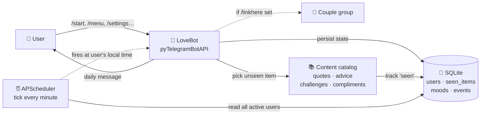

<div align="center">

<br/>


<br/>

# Relationship_telegram_bot❤️

### *A gentle, bilingual Telegram bot that walks every day of your relationship with you.*

<sub>هر روز یه پیام عاشقانه، یه توصیه، یه چالش، و یه روزشمار از شما و پارتنرتون. 💖</sub>

<br/>

<!-- tech badges -->
<p align="center">
  
  
  
  
</p>

<!-- features badges -->
<p align="center">
  
  
  
  
</p>

<!-- content stats -->
<p align="center">
  
  
  
  
</p>

<br/>

> *"You're the home I never have to leave."*
> *«عشق یعنی پیدا کردن خونه‌ای که هیچ‌وقت لازم نیست ترکش کنی.»*

<br/>

</div>

<details>
<summary><b>📖 Table of Contents · فهرست</b></summary>

- [About · درباره](#-about--درباره)
- [Live Demo · پیش‌نمایش](#-live-demo--پیش‌نمایش)
- [Features · فیچرها](#-features--فیچرها)
- [Delivery Modes · جایی که پیام میره](#-delivery-modes--جایی-که-پیام-میره)
- [Architecture · معماری](#-architecture--معماری)
- [Quick Start · شروع سریع](#-quick-start--شروع-سریع)
- [Commands · دستورات](#-commands--دستورات)
- [Configuration · تنظیمات](#-configuration--تنظیمات)
- [The No-Repeat Engine · موتور بدون-تکرار](#-the-no-repeat-engine--موتور-بدون-تکرار)
- [Sample Content · نمونه محتوا](#-sample-content--نمونه-محتوا)
- [Project Structure · ساختار پروژه](#-project-structure--ساختار-پروژه)
- [Deployment · دیپلوی](#-deployment--دیپلوی)
- [Contributing · مشارکت](#-contributing--مشارکت)
- [License · مجوز](#-license--مجوز)

</details>

---

## 💫 About · درباره

<table>
<tr>
<td width="50%" valign="top">

### 🇬🇧 English

**Relationship_telegram_bot❤️** is a *bilingual*, *per-user* Telegram bot that
becomes a small, kind companion to your relationship. It greets you every
morning at the time you chose, in the language you chose, in your local
timezone, with a freshly-picked love quote, a daily tip, today's tiny
challenge — and on special days, it remembers what you would have forgotten.

It is built for *one couple at a time, repeated infinitely*: deploy once,
let every couple onboard themselves with a single `/start`. No shared
`GROUP_ID` env, no manual edits — just a conversation.

</td>
<td width="50%" valign="top">

### 🇮🇷 فارسی

**Relationship_telegram_bot❤️** یک ربات تلگرامی *دو زبانه* و *تک‌کاربره* است
که می‌خواد یه همراه آروم و مهربون برای رابطه‌ات باشه. هر روز صبح، رأس همون
ساعتی که گفتی، به زبانی که گفتی، به وقت محلی خودت، یه جمله‌ی عاشقانه‌ی تازه،
یه توصیه، یه چالش کوچیک — و توی روزای خاص، چیزایی که ممکنه فراموش کنی، یادت
میاره.

طوری ساخته شده که *برای هر زوج جدا کار کنه، بی‌نهایت*: یه بار دیپلوی کن، هر
زوج با یه `/start` ساده خودش ست‌آپ می‌کنه. نه `GROUP_ID` ای، نه env دستی —
فقط یه گفت‌و‌گو.

</td>
</tr>
</table>

---

## 🎬 Live Demo · پیش‌نمایش

<table>
<tr>
<td valign="top">

**👤 You**
```
/start
```

**🤖 Bot**
```
💕 Hi, and welcome to LoveBot!
First, pick your language:

 [ 🇮🇷 فارسی ]   [ 🇬🇧 English ]
```

**👤 You** → *taps 🇬🇧 English*

**🤖 Bot**
```
🌸 What's your name?
(How would you like me to call you?)
```

**👤 You**
```
Soheil
```

**🤖 Bot**
```
💝 And what's your partner's name?
```

**👤 You**
```
Shamim
```

</td>
<td valign="top">

**🤖 Bot** *(next morning, 09:00)*
```
🌅 Good morning, my love!

💕 Today is *day 100* of your story with Shamim!

🎉 *Today is a milestone!* 🎊🥳✨

💝 Today's quote:
_You're the home I never have to leave._ 🏡

💡 Today's advice:
_Today, name three things that make your
 partner beautiful — say them out loud._

🌹 With love, your companion bot.
```

</td>
</tr>
</table>

---

## ✨ Features · فیچرها

<table>
<tr>
<td width="33%" align="center" valign="top">

### 🌐
**Truly bilingual**

Every UI string in **Persian + English**. Each user picks their own.

</td>
<td width="33%" align="center" valign="top">

### 🧭
**Interactive onboarding**

`/start` walks each user step-by-step. No env vars, no manual edits.

</td>
<td width="33%" align="center" valign="top">

### 💝
**Never repeats**

Quotes, advice, challenges, compliments — never repeat until the whole catalog is seen.

</td>
</tr>
<tr>
<td align="center" valign="top">

### 🎯
**Daily challenges**

Tiny, doable activities that strengthen your bond — *80+ per language*.

</td>
<td align="center" valign="top">

### 🌟
**Ready-to-send compliments**

Copy-and-send compliments addressed to your partner — *100+ per language*.

</td>
<td align="center" valign="top">

### 📅
**Milestone tracker**

Day count, humanised durations, countdown to the next big day.

</td>
</tr>
<tr>
<td align="center" valign="top">

### 🎂
**Auto birthday wishes**

Yours *and* your partner's — never miss the day.

</td>
<td align="center" valign="top">

### 📌
**Custom events**

First date? Trip? Add any date — get its countdown.

</td>
<td align="center" valign="top">

### 😊
**Mood log**

Track how you feel about the relationship over time.

</td>
</tr>
<tr>
<td align="center" valign="top">

### ❤️
**Love score & streak**

Light gamification keeps the daily ritual alive.

</td>
<td align="center" valign="top">

### ⏰
**Personal time + timezone**

Message at *your* local time, anywhere on Earth.

</td>
<td align="center" valign="top">

### ⚙️
**Transparent settings**

Edit anything; delete your data anytime, no questions asked.

</td>
</tr>
</table>

---

## 📨 Delivery Modes · جایی که پیام میره

<table>
<tr>
<td width="50%" valign="top">

### 🤍 Private — *default*

Each partner starts the bot in DM and receives **their own personalised feed** there.

**How:** just `/start` in private chat.

```
👤 Soheil  →  💌  →  📱 Soheil's DM
👤 Shamim  →  💌  →  📱 Shamim's DM
```

> Best when each partner wants their own settings, mood log, and score.

</td>
<td width="50%" valign="top">

### 👥 Shared group

After onboarding, add the bot to your couple group and run `/linkhere` there.
**One** message arrives in the group, owned by the partner who linked it.

**How:** in the target group, send `/linkhere`. Revert with `/unlinkhere`.

```
👤 Soheil  →  💌  →  👥 Couple group
                       (Shamim sees it too)
```

> Best when you want a single, shared daily ritual.

</td>
</tr>
</table>

> 🔐 **Privacy:** menus, mood logs, settings, and onboarding always stay in private chat — only the daily love note and birthday wishes are routed to the group.

---

## 🏗 Architecture · معماری



---

## 🚀 Quick Start · شروع سریع

> **Prereqs:** Python 3.10+, a Telegram bot token from [@BotFather](https://t.me/BotFather).

```bash
# 1️⃣  Clone the repo
git clone https://github.com/Soheilll-2006/telegram-relationship-bot.git
cd telegram-relationship-bot

# 2️⃣  Create + activate a virtualenv
python -m venv .venv
source .venv/bin/activate          # Windows: .venv\Scripts\activate

# 3️⃣  Install the dependencies
pip install -r requirements.txt

# 4️⃣  Configure your bot
cp .env.example .env               # then paste BOT_TOKEN from @BotFather

# 5️⃣  Run it
python main.py
```

Open Telegram, find your bot, hit `/start` — the bot will guide you through everything.

<details>
<summary><b>🪟 Windows PowerShell variant</b></summary>

```powershell
git clone https://github.com/Soheilll-2006/telegram-relationship-bot.git
Set-Location telegram-relationship-bot

python -m venv .venv
.venv\Scripts\Activate.ps1

pip install -r requirements.txt
Copy-Item .env.example .env        # edit .env and add your BOT_TOKEN
python main.py
```

</details>

---

## 🧰 Commands · دستورات

<div align="center">

| Command | 🇬🇧 Action | 🇮🇷 کار |
| :--- | :--- | :--- |
| `/start` | Start or restart onboarding | شروع/راه‌اندازی |
| `/menu` | Show the main inline menu | منوی اصلی |
| `/quote` | A fresh, never-repeating love quote | جمله‌ی عاشقانه‌ی تازه |
| `/advice` | Today's relationship advice | توصیه‌ی روز |
| `/challenge` | A tiny challenge for today | چالش امروز |
| `/compliment` | A ready-to-send compliment | تعریف آماده برای پارتنر |
| `/milestone` | Days together + next milestone | روزشمار و نقطه‌ی عطف بعدی |
| `/countdown` | Anniversary, birthdays, custom events | شمارش معکوس مناسبت‌ها |
| `/mood` | Log how you feel today | ثبت حال امروز |
| `/lovescore` | Your love score + streak | امتیاز عشق و استریک |
| `/settings` | Language · names · dates · time · timezone | تنظیمات کامل |
| `/linkhere` | **In a group** — pin delivery here | داخل گروه — مقصد رو همین گروه کن |
| `/unlinkhere` | Revert delivery to private | برگردوندن مقصد به پی‌وی |
| `/help` | Help text | راهنما |
| `/skip` | Skip the current question | رد کردن سؤال جاری |
| `/cancel` | Cancel the current flow | لغو عملیات جاری |

</div>

---

## 🔐 Configuration · تنظیمات

All configuration is via environment variables (or a `.env` file alongside `main.py`).

| Variable | Required | Default | What it does |
| :--- | :---: | :--- | :--- |
| `BOT_TOKEN` | ✅ | — | Your bot token from [@BotFather](https://t.me/BotFather). |
| `DB_PATH` | ❌ | `lovebot.db` | Path to the SQLite file. Persistent across restarts. |
| `KEEP_ALIVE` | ❌ | `false` | Run a tiny Flask web server alongside the bot (great for Replit). |
| `KEEP_ALIVE_PORT` | ❌ | `5000` | Port for the keep-alive server. |
| `LOG_LEVEL` | ❌ | `INFO` | `DEBUG` · `INFO` · `WARNING` · `ERROR`. |

> 💡 Per-user settings (language, names, dates, time, timezone, daily on/off…) are **not** env vars — each user configures them via `/start` and `/settings`.

---

## 🧠 The No-Repeat Engine · موتور بدون-تکرار

Every category (quotes · advice · challenges · compliments) is a **stable, indexed list**. Each shown item is recorded in `seen_items` per `user_id + category`. The picker excludes seen items and only resets history once the *entire* catalogue has been served — then it loops with a fresh shuffle.

```
        ┌─ catalog (223 items) ─┐
draw  → │  • • • • ◯ • • • ◯  │ → store "seen"
        │  • ◯ • • • • ◯ • •  │
        └────────────────────────┘
           ▲                  │
           │                  ▼
   draw again, never seen   when all seen → reset & loop
```

For a typical 200+ item catalog and one quote a day, that means **months without a repeat** — and when it does cycle, it feels fresh again.

---

## 💌 Sample Content · نمونه محتوا

<table>
<tr>
<td width="50%" valign="top">

#### 🇮🇷 فارسی

> *عشق یعنی پیدا کردن خونه‌ای که هیچ‌وقت لازم نیست ترکش کنی.* 💕

> *هر روز با تو، روز شنبه‌ی قلبمه.* 🌞

> *تو همون داستانی هستی که می‌خوام تا آخرش بمونم.* 📖

> *وقتی کنارمی، حتی سکوت هم آهنگ می‌شه.* 🎶

> *تو همون «دلیلِ امروزِ من» هستی.* 🌟

</td>
<td width="50%" valign="top">

#### 🇬🇧 English

> *You're the home I never have to leave.* 🏡💕

> *Every day with you feels like the weekend of my heart.* 🌞

> *You're the story I want to be in until the last page.* 📖

> *Even our silences are music when you're near.* 🎶

> *You are my "reason for today".* 🌟

</td>
</tr>
</table>

<sub>+ 218 more in each language for quotes alone. Same for advice, challenges, compliments.</sub>

---

## 📁 Project Structure · ساختار پروژه

```
telegram-relationship-bot/
├── main.py                     # entry point — wires everything together
├── README.md
├── LICENSE
├── pyproject.toml
├── requirements.txt
├── .env.example
├── .gitignore
└── lovebot/                    # the Python package
    ├── __init__.py
    ├── config.py               # env / Settings dataclass
    ├── database.py             # SQLite + per-user state + seen_items
    ├── bot.py                  # commands, callbacks, onboarding state machine
    ├── scheduler.py            # APScheduler tick — per-user local-time delivery
    ├── keep_alive.py           # optional Flask "I'm alive" server
    ├── keyboards.py            # inline keyboards
    ├── content_picker.py       # the no-repeat picker
    ├── i18n.py                 # FA/EN UI strings + mood labels
    ├── utils.py                # date/number/time helpers
    └── content/
        ├── quotes.py           # 223 love quotes per language
        ├── advice.py           # 109 relationship tips per language
        ├── challenges.py       # 83 couple challenges per language
        ├── compliments.py      # 105 partner compliments per language
        └── greetings.py        # morning/closing variants per language
```

---

## 🌍 Deployment · دیپلوی

LoveBot uses local SQLite — **no external DB needed**. Deploy as a long-running Python process. Recommended hosts:

| Host | Notes |
| :--- | :--- |
| 🟢 **VPS / your own server** | Best stability. Run with `systemd`, `supervisord`, or `pm2`. |
| 🟢 **Render / Railway / Fly.io** | Background worker. Set `BOT_TOKEN` in their secret manager. |
| 🟡 **Replit (free)** | Set `KEEP_ALIVE=true` so a tiny Flask server keeps the repl awake. |
| 🟡 **Docker** | A 10-line `Dockerfile` is enough — there's no native dependency. |

<details>
<summary><b>📦 Minimal Dockerfile</b></summary>

```dockerfile
FROM python:3.12-slim
WORKDIR /app
COPY requirements.txt .
RUN pip install --no-cache-dir -r requirements.txt
COPY . .
CMD ["python", "main.py"]
```

</details>

---

## 🤝 Contributing · مشارکت

PRs welcome — especially:

- 🌹 More high-quality quotes / advice / challenges (please keep them culturally inclusive and PG).
- 🌐 Translations for a third language — drop a `lovebot/content/quotes_de.py` (etc.) and wire it in `i18n.py` + `SUPPORTED_LANGUAGES`.
- 🧪 Tests for the SQLite layer and the no-repeat picker.
- 🎨 Polish for the inline UI and keyboards.

Before opening a PR, please run a quick syntax check:

```bash
python -m py_compile main.py $(find lovebot -name "*.py")
```

---

## 📜 License · مجوز

Distributed under the **MIT License** — see [`LICENSE`](LICENSE). Use it, fork it, gift it.

---

<div align="center">

<br/>

<sub><b>Relationship_telegram_bot❤️</b></sub>

**Made with 💕 for partners, by partners.**

<sub>If this bot makes your relationship smile, a ⭐ on the repo really does help.</sub>

<br/>

<a href="https://github.com/Soheilll-2006/telegram-relationship-bot/stargazers">
  
</a>

<br/><br/>

<sub>💖 برای هر زوجی که اینو پیدا می‌کنه — همیشه عاشق بمونید. 💖</sub>

</div>
